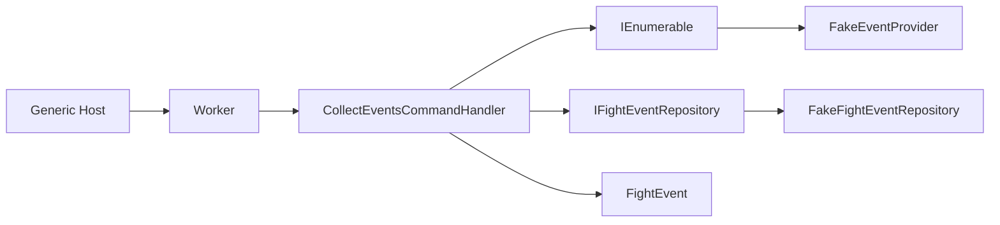
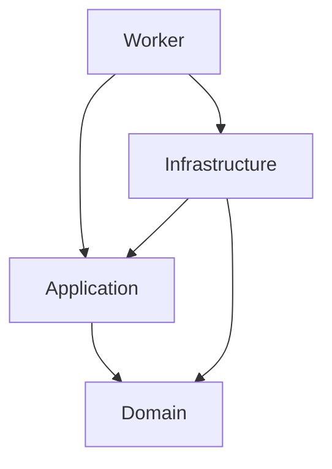

# Arquitetura

## Estilo atual

O projeto segue Clean Architecture explícita em quatro projetos. O caso de uso inicial é `CollectEvents` e atualmente é disparado por um Worker hospedado.

## Dependências

| Projeto | Responsabilidade |
|---|---|
| Domain | Modelo de negócio: `FightEvent` |
| Application | Caso de uso de coleta e contratos de provider/persistência |
| Infrastructure | Adaptadores concretos atualmente falsos |
| Worker | Host, DI e disparo da coleta |

## Fluxo de dados atual

1. O host registra `Worker`, `FakeEventProvider`, `FakeFightEventRepository` e `CollectEventsCommandHandler`.
2. `Worker.ExecuteAsync` cria um escopo, resolve o handler e chama `Handle(new CollectEventsCommand(), token)`.
3. O handler pede eventos a cada provider registrado e agrega os resultados.
4. O handler passa todos os eventos ao repositório por `AddRangeAsync`.
5. O repositório fake somente registra a quantidade; não existe armazenamento.

## Limites atuais

Não há API HTTP, autenticação, banco, mensageria, scheduler recorrente, paralelismo ou tolerância de falha por provider. Esses itens são evolução planejada, não componentes da arquitetura atual.
