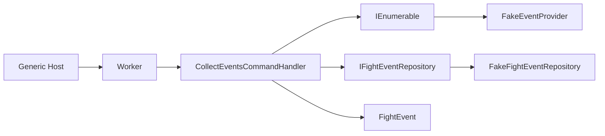
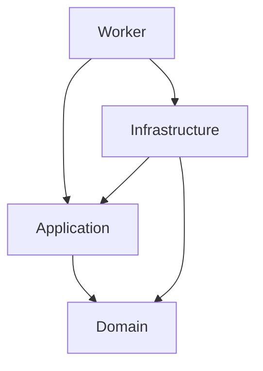

# PowerGrind.FightEvents

> Serviço de coleta de eventos de luta para o ecossistema PowerGrind.

O **PowerGrind.FightEvents** é um Worker Service .NET separado da API principal. Seu objetivo é, futuramente, coletar eventos de luta de fontes externas, normalizá-los e disponibilizá-los para uso pelo produto PowerGrind.

> **Estado do projeto:** o fluxo técnico está demonstrado ponta a ponta com provider e repositório fake. Não há fontes externas, banco de dados, execução recorrente nem integração ativa com a API principal.

## O que já funciona

- Solução .NET 10 dividida em Domain, Application, Infrastructure e Worker.
- Entidade de domínio `FightEvent`.
- Abstrações `IEventProvider` e `IFightEventRepository` na Application.
- Caso de uso `CollectEvents`, que agrega resultados de todos os providers registrados e chama `AddRangeAsync`.
- `BackgroundService` que cria um escopo e dispara a coleta ao iniciar.
- `FakeEventProvider`, que devolve dois eventos de demonstração após atraso simulado.
- `FakeFightEventRepository`, que registra em log a quantidade recebida.

## Arquitetura





| Projeto | Responsabilidade |
|---|---|
| `PowerGrind.FightEvents.Domain` | Entidade `FightEvent`, sem dependências de outros projetos |
| `PowerGrind.FightEvents.Application` | Contratos e feature `Events/Collect` |
| `PowerGrind.FightEvents.Infrastructure` | Implementações concretas de providers e persistência; hoje, apenas fakes |
| `PowerGrind.FightEvents.Worker` | Host, DI e disparo do caso de uso |

## Fluxo atual

```text
Worker.ExecuteAsync
  -> CollectEventsCommandHandler.Handle(new CollectEventsCommand())
  -> cada IEventProvider.GetEventsAsync(cancellationToken)
  -> agregação dos eventos coletados
  -> IFightEventRepository.AddRangeAsync(...)
  -> CollectEventsResponse(total de eventos)
```

O Worker executa esse fluxo **uma única vez** durante o startup. Não há `PeriodicTimer`, cron, loop de repetição ou scheduler.

## Executar localmente

### Pré-requisitos

- .NET SDK 10

### Executar

```bash
dotnet run --project src/PowerGrind.FightEvents.Worker
```

O resultado esperado no estágio atual é um log de coleta do `Fake Provider`, seguido pelo log informando que dois eventos foram recebidos pelo repositório fake.

## MediatR: estado atual

A Application referencia MediatR e `CollectEventsCommand` implementa `IRequest<CollectEventsResponse>`. No entanto, o Worker resolve `CollectEventsCommandHandler` diretamente e chama `Handle`; o handler não implementa `IRequestHandler` e não há `IMediator.Send` no fluxo.

Isso significa que MediatR está **presente, mas não é usado como dispatcher do caso de uso**. A decisão de mantê-lo, removê-lo ou adotá-lo de ponta a ponta permanece pendente; o README não assume CQRS/MediatR completo como funcionalidade existente.

## Próximos passos

- Definir uma primeira fonte autorizada de eventos e contrato de dados.
- Implementar persistência real, migrations e política de identidade/upsert.
- Adicionar normalização, validação e deduplicação entre fontes.
- Tornar a coleta periódica e resiliente, com timeout, retry e isolamento de falhas por provider.
- Adicionar testes, logs estruturados, métricas, health checks e CI/CD.
- Definir o contrato de consumo com a API principal do PowerGrind.

## Contexto de produto

O PowerGrind é planejado como SaaS para academias de luta, alunos e treinadores. `FightEvents` será uma capacidade complementar de dados de eventos para esse ecossistema; público consumidor, modalidades e forma de integração ainda precisam de decisão. Consulte [.ai/context/product_vision.md](.ai/context/product_vision.md).

## Documentação para colaboradores e agentes

A pasta [`.ai`](.ai/) é a fonte de contexto operacional:

- [estado atual](.ai/context/current_state.md)
- [arquitetura](.ai/architecture/architecture.md)
- [roadmap](.ai/context/roadmap.md)
- [backlog](.ai/kanban/backlog.md)
- [ADRs](.ai/architecture/adrs/)

Antes de alterar arquitetura ou comportamento, leia esses documentos e valide afirmações contra o código local.

## Licença

Nenhuma licença foi definida neste repositório.
